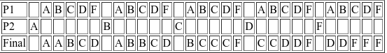
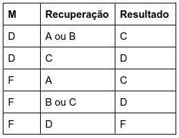
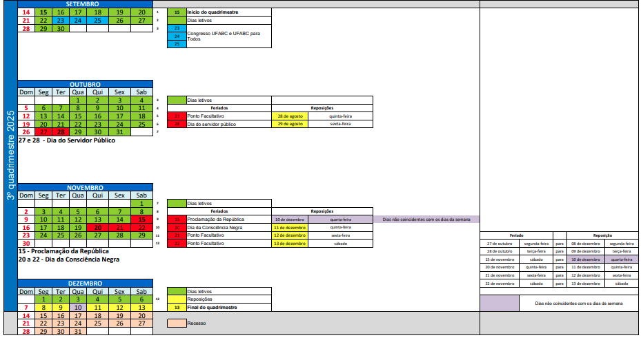

**Avisos:** P1 dia 03; [soluções](Solucoes.pdf) de alguns exercícios das listas. [Soluções](p1.pdf) da P1. 

P2 dia 01/12; soluções [aqui](Exercícios de Markov 4— respostas.pdf) e [aqui](Exercícios de Markov 5— respostas.pdf) e [aqui](Exercícios de Markov 6— respostas.pdf) de alguns exercícios.  [Soluções da P2](p2.pdf) 

**Rec** em 11/12

------

MCBM022-23 Introdução aos Processos Estocásticos 

[**Jair Donadelli**](http://hostel.ufabc.edu.br/~jair.donadelli/)  (sala 546, torre 2, bloco A)						**email** jair.donadelli@ufabc.edu.br

[toc]

Nessa disciplina vamos estudar os conceitos fundamentais de cadeias de Markov em tempo discreto e contínuo, martingais e teoria da renovação, com foco em suas propriedades, aplicações em modelagem e demonstrações teóricas. Calcular probabilidades de transição, retorno e limites, além de resolver e modelar situações-problema envolvendo esses temas.

**onde:** Seg. 21-23h; Qui. 19-21h na sala A-114-0

**TPEI** 4-0-0-4 **RECOMENDAÇÃO**: Álgebra Linear; Cálculo de Probabilidade 

**Atenção:** todo comunicado do professor para os alunos será feito via Siga, portanto, atente-se ao seu endereço de email dessa plataforma. Não use o Siga para se comunicar com o professor, envie email para o endereço acima.

**EMENTA** Cadeias de Markov discretas e comportamento assintótico: passeios aleatórios, processo de ramificação. Processos de Poisson. Cadeias de Markov em tempo contínuo. Processos de renovação. Martingales. Introdução ao movimento browniano. 

**BIBLIOGRAFIA BÁSICA** 

ROSS, Sheldon M. *Introduction to probability models*. 10. ed. Burlington: Academic Press, 2010. xv, 784 p. ISBN 9780123756862.  

DURRETT, Richard. *Essentials of stochastic processes*. New York: Springer, 1999. vi, 281 p. (Springer texts in statistics). ISBN 9780387988368.  

HAIGH, John. *Probability models*. Falmer: Springer, 2002. viii, 256 p. (Springer undergraduate mathematics). ISBN 1852334312.  

**BIBLIOGRAFIA COMPLEMENTAR** 

GRIMMETT, Geoffrey; STIRZAKER, David. *Probability and random processes*. 3. ed. Oxford; New York: Oxford University Press, 2001. xii, 596 p. ISBN 9780198572220.  

BHAT, U. Narayan; MILLER, Gregory K. *Elements of applied stochastic processes*. 3. ed. Hoboken: Wiley Publishing, 2002. xi, 461 p. (Wiley series in probability and statistics). ISBN 9780471414421.  

TAYLOR, Howard M.; KARLIN, Samuel. *An introduction to stochastic modeling*. 3. ed. San Diego: Academic Press, 1998. xi, 631 p. ISBN 9780126848878.  

RESNICK, Sidney I. *Adventures in stochastic processes*. Boston: Birkhäuser, 1992. xii, 626 p. ISBN 9780817635916.   

**MATERIAL BIBLIOGRÁFICO COMPLEMENTAR** 

[Probability, Mathematical Statistics, Stochastic Processes](https://www.randomservices.org/random/index.html)

[Finite Markov Chains and Algorithmic Applications](https://cms.dm.uba.ar/academico/materias/verano2018/probabilidades_y_estadistica_C/Haggstrom-Finite%20Markov%20chains%20and%20algorithm%20applications.pdf)

[Markov Chains and Mixing Times](https://pages.uoregon.edu/dlevin/MARKOV/mcmt2e.pdf)

[Brownian Motion](https://www.mi.uni-koeln.de/~moerters/book/book.pdf)

## **Cronograma das aulas**

| Semana e Tema                                                | Tópicos                                                      | Referências e xercícios                                      |
| ------------------------------------------------------------ | ------------------------------------------------------------ | ------------------------------------------------------------ |
| **Semana 1 – Introdução a Processos Estocásticos**           | - Plano de ensino   - Conceitos de Probabilidade - Espaço de estados, tempo discreto vs. contínuo. | - [Lista revisão de probabilidade](ExerciciosDeRevisao.html) - [slide](semana01.pdf) |
| **Semana 2 – Introdução a Cadeias de Markov Discretas**      | - Propriedade de Markov e homogeneidade no tempo. - Matriz de transição $P$, distribuição inicial e evolução $\pi^{(n)} = \pi^{(0)} P^n$. | Ross, 4.1–4.2. G&S (Grimmet & Stirzaker), Cap. 6.1–6.2. - [gerador de lero-lero](https://lero-markov-lero.streamlit.app/) - [Exercícios](ExerciciosMarkov.html) |
| **Semana 3 –  Análise de primeiro passo. Propriedade Forte de Markov. Classificação de estados.** | - Análise de primeiro passo.  - Recorrência e transiência.  - Estados absorventes. Probabilidade e tempo médio de absorção. | Ross, 4.2–4.3. G&S, Cap. 6.1. - [Exercícios](ExerciciosMarkov2.html)  - [Propriedade Forte de Markov](CFM.pdf) |
| **Semana 4 – Classificação de Estados e Cadeias. **          | -  Propriedade Forte de Markov. - Tempo de primeira passagem e caracterização de recorrência e transiência.   | Ross, Cap. 4.3–4.4. G&S, Cap. 6.2–6.3. - [Exercícios](ExerciciosMarkov3.html)   |
| **Semana 5 – Distribuições Invariantes**                     | - Conjuntos fechados. Classes de comunicação. - Distribuição limite e distribuição estacionária. - Cadeias irredutiveis | Ross, Cap. 4.4. G&S, Cap. 6.4. - [Exercícios](ExerciciosMarkov4.html)   |
| **Semana 6 – Distribuições Invariantes e Convergência**      | - Cadeias aperiódicas. - Teorema ergódico (caso finito). | Idem [Teorema ergódico](ergodico.pdf)                    |
| **Semana 7** (feriado na 2ª)                                 | Aula de exercícios                                           |                                                              |
| **Semana 8 **                                                | - Prova 1  -  Cont. Teorema ergódico                     |                                                              |
| **Semana 9 – Exemplos. Tempo de Mistura**                    | - tempo de mistura  - embaralhamento - Page rank     | Notas de aula/slides: [Embaralhamento](rf.pdf)  [PageRank](pagerank.pdf) [Exercícios](ExerciciosMarkov5.html) |
| **Semana 10 – Martingais discretos**                         | - Martingal. - Propriedades básicas. - Teorema de parada opcional (forma simples). | Ross, Cap. 13.1–13.3. G&S, Cap. 12.1–12.4. - [Exercícios](ExerciciosMarkov6.html)   |
| **Semana 11 – Martingais discretos**                         | idem                                                         | idem [teorema da Urna ou teorema do Escrutíno (*Ballot*)](ballot.pdf) |
| **Semana 12 –** **Avaliação**                                | *Conteúdo a partir da P1*                                |                                                              |
| **Semana de reposição - Recuperação**                        | Todo conteúdo                                                |                                                              |

## **Avaliação**

2 **provas**. As avaliações são individuais. Serão atribuídos conceitos nas atividades avaliativas e o resultado é definido como segue:

### Substitutiva e Recuperação

A **sub é aberta** a qualquer aluno. Será aplicada no último dia de aula do calendário regular. O aluno deve manifestar interesse em fazer a sub de acordo com as instruções que serão enviadas por email em momento apropriado durante o curso da disciplina.

Tem direito ao exame recuperação aqueles que foram aprovado com D ou reprovado com F e obtiveram frequência mínima.  O resultado do exame é um conceito que compõe com o conceito final **M** obtido na avaliação regular da disciplina como segue:

O aluno deve manifestar interesse em fazer a recuperação de acordo com as instruções que serão enviadas por email em momento apropriado durante o curso da disciplina.

Exame de recuperação em 11/12, 5ª feira, na sala e horário usuais.

## **Atendimento**

 2ª 20hs e 5ª 21hs  ou qualquer outro horário combinado previamente.

------

[**Calendário acadêmico**](https://prograd.ufabc.edu.br/pdf/calendario_academico_2025.pdf)

