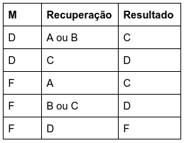
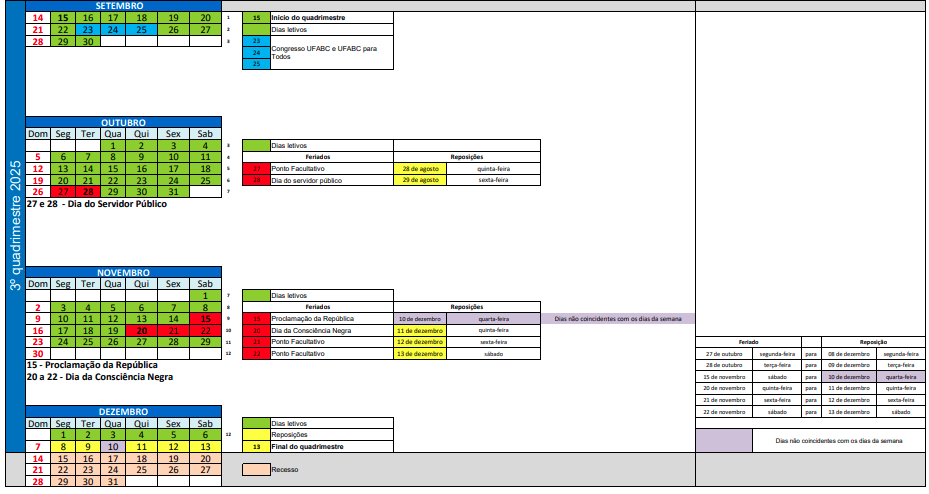

MCBM022-23 Introdução aos Processos Estocásticos 

[**Jair Donadelli**](http://hostel.ufabc.edu.br/~jair.donadelli/)  (sala 546, torre 2, bloco A)						**email** jair.donadelli@ufabc.edu.br

[toc]

Nessa disciplina vamos estudar os conceitos fundamentais de cadeias de Markov em tempo discreto e contínuo, martingales e teoria da renovação, com foco em suas propriedades, aplicações em modelagem e demonstrações teóricas. Calcular probabilidades de transição, retorno e limites, além de resolver e modelar situações-problema envolvendo esses temas.

**onde:** Seg. 21-23h (semanal); Qui. 19-21h (semanal) na sala 

**TPEI** 4-0-0-4 **RECOMENDAÇÃO**: Álgebra Linear; Cálculo de Probabilidade 

**EMENTA** Cadeias de Markov discretas e comportamento assintótico: passeios aleatórios, processo de ramificação. Processos de Poisson. Cadeias de Markov em tempo contínuo. Processos de renovação. Martingales. Introdução ao movimento browniano. 

**BIBLIOGRAFIA BÁSICA** 

DURRETT, Richard. Essentials of stochastic processes. New York, USA: Springer, 1999. vi, 281. (Springer texts in statistics). ISBN 9780387988368. 

HAIGH, John. Probability models. Falmer, GBR: Springer, 2002. viii, 256. (Springer undergraduate mathematics). ISBN 1852334312. 

ROSS, Sheldon M. Introduction to probability models. 10. ed. Burlington, USA: Academic Press, 2010. xv, 784 p., il. ISBN 9780123756862. 

**BIBLIOGRAFIA COMPLEMENTAR** 

BHAT, U. Narayan; MILLER, Gregory K. Elements of applied stochastic processes. 3. ed. Hoboken, USA: Wiley Publishing, 2002. xi, 461. (Wiley series in probability and statistics). ISBN 9780471414421. 

GRIMMETT, Geoffrey; STIRZAKER, David. Probability and random processes. 3. ed. Oxford, GBR; New York, USA: Oxford University Press, 2001. xii, 596 p., il. Includes bibliographical references (p. [580]-582) and index. ISBN 9780198572220. 

TAYLOR, Howard M.; KARLIN, Samuel. An introduction to stochastic modeling. 3. ed. San Diego, USA: Academic Press, 1998. xi, 631. ISBN 9780126848878. 955 

RESNICK, Sidney I. Adventures in stochastic processes. Boston, USA: Birkhäuser Science, c1992. xii, 626. ISBN 9780817635916. 

**MATERIAL COMPLEMENTAR** 

[Probability, Mathematical Statistics, Stochastic Processes](https://www.randomservices.org/random/)

[Finite Markov Chains and Algorithmic Applications](https://cms.dm.uba.ar/academico/materias/verano2018/probabilidades_y_estadistica_C/Haggstrom-Finite%20Markov%20chains%20and%20algorithm%20applications.pdf)

[Markov Chains and Mixing Times](https://pages.uoregon.edu/dlevin/MARKOV/mcmt2e.pdf)

[Brownian Motion](https://www.mi.uni-koeln.de/~moerters/book/book.pdf)

## **Cronograma**

| Semana e Tema                                                | Objetivos                                                    | Tópicos                                                      | Referências                               |
| ------------------------------------------------------------ | ------------------------------------------------------------ | ------------------------------------------------------------ | ----------------------------------------- |
| **Semana 1**                                                 | -Apresentação da disciplina - Compreender o conceito de processo estocástico. | -Plano de ensino  -Conceitos de Probabilidade - - Espaço de estados, tempo discreto vs. contínuo. | Lista revisão de probabilidade            |
| **Semana 2 – Introdução a Processos Estocásticos e Cadeias de Markov Discretas** | - Definir formalmente cadeia de Markov em tempo discreto. - Representar cadeias por matrizes de transição. | - Propriedade de Markov e homogeneidade no tempo. - Matriz de transição $P$, distribuição inicial e evolução $\pi^{(n)} = \pi^{(0)} P^n$. | Ross, Cap. 4.1–4.2. G&S, Cap. 6.1–6.2. |
| **Semana 3 – Classificação de Estados e Passeios Aleatórios** | - Classificar estados: acessibilidade, comunicação, absorção. - Estudar passeios aleatórios como exemplo central. | - Acessibilidade, comunicação, classes fechadas, estados absorventes. - Periodicidade e aperiocidade. - Passeio aleatório simples em $\mathbb{Z}$ e ciclos finitos. | Ross, Cap. 4.3. G&S, Cap. 6.3–6.5.     |
| **Semana 4 – Distribuições Invariantes e Convergência**      | - Calcular distribuições estacionárias. - Entender condições para existência e unicidade. - Estudar convergência em cadeias finitas. | - Definição: $\pi P = \pi$. - Cadeias irreducíveis e aperiódicas. - Teorema ergódico (caso finito). | Ross, Cap. 4.4. G&S, Cap. 6.6–6.8.     |
| **Semana 5 – Processos de Ramificação**                      | - Definir e analisar processo de Galton–Watson. - Usar funções geradoras para probabilidade de extinção. | - Definição e árvore de descendência. - Funções geradoras; regimes subcrítico, crítico e supercrítico. | Ross, Cap. 4.7. G&S, Cap. 6.9.         |
| **Semana 6 – Processos de Poisson**                          | - Definir e caracterizar processo de Poisson. - Relacionar chegadas com tempos exponenciais. | - Incrementos independentes e estacionários. - Distribuição de contagem (Poisson). - Distribuição de tempos (exponencial). - Superposição e divisão. | Ross, Cap. 5.1–5.3. G&S, Cap. 6.10.    |
| **Semana 7**                                                 | **Prova 1** (30/10)                                          | *Conteúdo até teorema ergódico*                              |                                           |
| **Semana 8 – Cadeias de Markov em Tempo Contínuo**           | - Introduzir cadeias de Markov em tempo contínuo. - Entender matriz geradora $Q$ e equações de Kolmogorov. | - Definição; taxas de transição. - Equações de Kolmogorov (direita e esquerda). - Processos de nascimento e morte. | Ross, Cap. 6.1–6.4. G&S, Cap. 6.11.    |
| **Semana 9 – Martingales**                                   | - Definir martingales em tempo discreto. - Estudar propriedades básicas e exemplos. | - Martingale, submartingale, supermartingale. - Propriedades básicas. - Teorema de parada opcional (forma simples). | Ross, Cap. 13.1–13.3. G&S, Cap. 12.    |
| **Semana 10  e 11– Introdução ao Movimento Browniano**       | - Definir movimento browniano e propriedades básicas. - Relacionar com passeios aleatórios como limite difusivo. | - Incrementos independentes e gaussianos. - Continuidade de trajetória. - Aproximação via passeio aleatório escalonado. | Ross, Cap. 10.1–10.3. G&S, Cap. 13.    |
| **Semana 12 –**                                              | P2 e Sub                                                     |                                                              |                                           |
| **Semana de reposição**                                      | Exame de recuperação                                         | Todo conteúdo                                                |                                           |

## **Avaliação**

### Recuperação

Tem direito ao exame recuperação, o qual engloba todo o conteúdo da disciplina, aqueles que foram aprovado com D ou reprovado com F e obtiveram frequência mínima.  O resultado do exame é um conceito que compõe com o conceito final **M** obtido na avaliação regular da disciplina como segue:

O aluno deve manifestar interesse em fazer a recuperação de acordo com as instruções que serão enviadas pelo siga em momento apropriado durante o curso da disciplina.

## **Atendimento**

 

